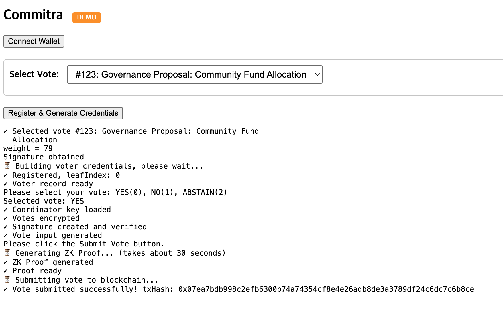
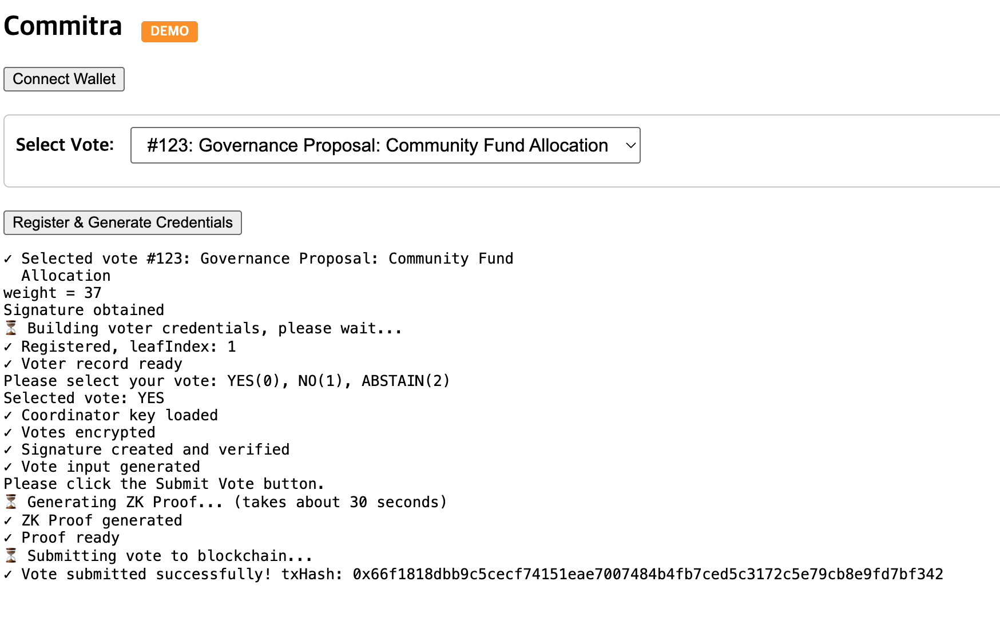
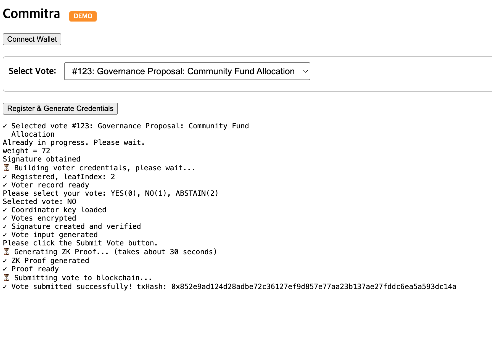

# Demo Walkthrough: End-to-End Vote Lifecycle

This document traces a **complete vote session** on the Commitra demo environment,
from vote creation to on-chain tally finalization.

This walkthrough is based on the public demo environment,
which intentionally simplifies certain assumptions
while preserving the full verification model.

Every step includes either a **browser screenshot** or an **on-chain transaction link**,
allowing independent verification without access to any source code.

**Network:** Ethereum Sepolia
**Vote session:** voteId = 123
**Title:** Governance Proposal: Community Fund Allocation

---

## Step 1. Vote creation

The vote session is created on-chain, establishing voteId 123.

| Field | Value |
|-------|-------|
| Tx hash | [`0xcd55cbb6...a6e2`](https://sepolia.etherscan.io/tx/0xcd55cbb605e84d12fa79ad36ea3ba8354df84786b97a688fc57b5b447668a6e2) |
| Method | `createVoteId(123)` |
| Event | `VoteIdCreated(voteId: 123)` |
| Contract | `0x896fB9AcbD6A2a3A2Db9635D3215c0eC5fFC33D9` |

From this point, eligible participants can submit encrypted votes.

---

## Step 2. Vote submissions

Three participants cast their votes through the demo interface.
Each vote is encrypted client-side and submitted with a zero-knowledge proof.

### Voter A

- **Weight:** 79
- **Choice:** YES

**Tx:** [`0x07ea7bdb...b8ce`](https://sepolia.etherscan.io/tx/0x07ea7bdb998c2efb6300b74a74354cf8e4e26adb8de3a3789df24c6dc7c6b8ce)

---

### Voter B

- **Weight:** 37
- **Choice:** YES

**Tx:** [`0x66f1818d...f342`](https://sepolia.etherscan.io/tx/0x66f1818dbb9c5cecf74151eae7007484b4fb7ced5c3172c5e79cb8e9fd7bf342)

---

### Voter C

- **Weight:** 72
- **Choice:** NO

**Tx:** [`0x852e9ad1...14a`](https://sepolia.etherscan.io/tx/0x852e9ad124d28adbe72c36127ef9d857e77aa23b137ae27fddc6ea5a593dc14a)

---

### What to notice

Open any of the three vote transactions on Etherscan and observe:

1. **No one can tell who voted for what.**
   The zero-knowledge proof verifies voter eligibility
   without revealing which voter submitted which vote.

2. **Even the server does not know.**
   Vote choices are encrypted client-side before submission.
   The coordinator receives and relays encrypted data
   that it cannot decrypt or link to a specific voter.

3. **No voter address appears on-chain.**
   All vote transactions are submitted by the coordinator,
   not by the voters themselves.
   There is no on-chain link between a participant's wallet and their vote.

---

## Step 3. Vote closure

After all participants have voted, the coordinator closes the voting period.

| Field | Value |
|-------|-------|
| Tx hash | [`0x7f0ec5b8...f184`](https://sepolia.etherscan.io/tx/0x7f0ec5b8e5582682ea567f88d455c922aaf71513ef56b37b499a95817ca8f184) |
| Action | `closeVoting` |

No further votes can be submitted after this transaction.

> **Note on batch padding:**
> The ZK tally circuit operates on a fixed batch size of 100.
> After closing, the system automatically pads the batch with
> zero-weight dummy votes. These do not affect the tally result.

---

## Step 4. Tally finalization

The encrypted votes are aggregated off-chain,
and a zero-knowledge proof is generated to verify correct computation.
The proof and final result are submitted on-chain.

| Field | Value |
|-------|-------|
| Tx hash | [`0xe8adbf71...5eff`](https://sepolia.etherscan.io/tx/0xe8adbf71e1d4051168c528802ea70c7db6bfd2dc8ef14c8b74b5e731dfdb5eff) |
| Event | `TallyFinalized` |

### Final result (on-chain)

| Choice | Weighted count |
|--------|----------------|
| YES | 116 |
| NO | 72 |
| ABSTAIN | 0 |

---

## Step 5. Manual verification

The on-chain result can be cross-checked against the screenshots above:

| Voter | Weight | Choice | Contribution |
|-------|--------|--------|-------------|
| A | 79 | YES | YES + 79 |
| B | 37 | YES | YES + 37 |
| C | 72 | NO | NO + 72 |

- **YES total:** 79 + 37 = **116**
- **NO total:** 72 = **72**
- **ABSTAIN total:** 0 = **0**

The manually computed result matches the on-chain tally exactly.

---

## Summary

This walkthrough demonstrates that:

1. A vote session was created and recorded on-chain
2. Three participants voted with encrypted ballots and ZK proofs
3. **No vote choice is visible** in any on-chain transaction
4. The voting period was formally closed on-chain
5. The final tally was computed and verified via a zero-knowledge proof
6. The on-chain result **matches the sum of individual votes exactly**
7. **Neither voter identities nor vote choices are linkable on-chain**

All transactions are publicly verifiable on Ethereum Sepolia.

This document is intended to demonstrate verifiability and privacy guarantees,
not to serve as a user-facing voting product.
