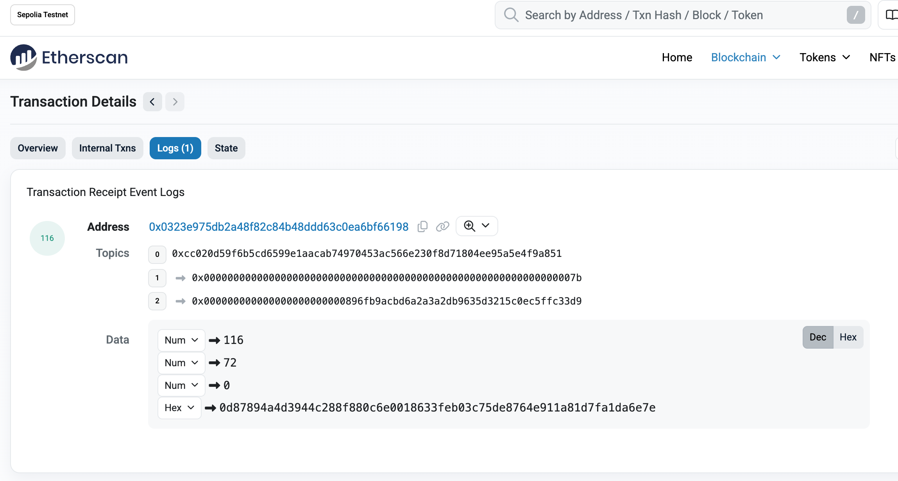

# Demo Walkthrough: End-to-End Vote Lifecycle

This document traces a **complete vote session** on the Commitra demo environment, from vote creation to on-chain tally finalization.

Every step includes either a **browser screenshot** or an **on-chain transaction link**. All three votes in this record were cast from wallets controlled by the author — the **self-verification pattern**: because the recorder knows every weight and choice, the final on-chain result can be checked exactly against the inputs (step 5). That is the point of this walkthrough: the honest-participant flow, end to end, with the arithmetic visible.

What this walkthrough does **not** establish — adversarial robustness, batch binding, operator behavior — is documented in [`../../docs/threat-model.md`](../../docs/threat-model.md) and summarized at the end.

**Network:** Ethereum Sepolia
**Vote session:** voteId = 123
**Title:** Governance Proposal: Community Fund Allocation

---

## Step 1. Vote creation

The vote session is created on-chain, establishing voteId 123.

| Field | Value |
|-------|-------|
| Tx hash | [`0xcd55cbb6...a6e2`](https://sepolia.etherscan.io/tx/0xcd55cbb605e84d12fa79ad36ea3ba8354df84786b97a688fc57b5b447668a6e2) |
| Method | `createVoteId(123)` |
| Event | `VoteIdCreated(voteId: 123)` |
| VotingContract | [`0x896fB9AcbD6A2a3A2Db9635D3215c0eC5ffc33D9`](https://sepolia.etherscan.io/address/0x896fB9AcbD6A2a3A2Db9635D3215c0eC5ffc33D9) |
| TallyContract | [`0x0323e975db2a48f82c84b48dDD63c0eA6bF66198`](https://sepolia.etherscan.io/address/0x0323e975db2a48f82c84b48dDD63c0eA6bF66198) |

From this point, participants can submit encrypted votes.

---

## Step 2. Vote submissions

Three votes are cast through the demo interface. Each is encrypted client-side and submitted with a browser-generated Groth16 proof.

### Voter A

- **Weight:** 79
- **Choice:** YES

**Tx:** [`0x07ea7bdb...b8ce`](https://sepolia.etherscan.io/tx/0x07ea7bdb998c2efb6300b74a74354cf8e4e26adb8de3a3789df24c6dc7c6b8ce)

---

### Voter B

- **Weight:** 37
- **Choice:** YES

**Tx:** [`0x66f1818d...f342`](https://sepolia.etherscan.io/tx/0x66f1818dbb9c5cecf74151eae7007484b4fb7ced5c3172c5e79cb8e9fd7bf342)

---

### Voter C

- **Weight:** 72
- **Choice:** NO

**Tx:** [`0x852e9ad1...14a`](https://sepolia.etherscan.io/tx/0x852e9ad124d28adbe72c36127ef9d857e77aa23b137ae27fddc6ea5a593dc14a)

---

### What to notice — stated precisely

Open any of the three vote transactions on Etherscan and observe:

1. **No vote choice appears on-chain.** The transaction carries a proof, public signals (Merkle root, nullifier, ciphertext hash), and events — no plaintext choice, and no ciphertext contents either.

2. **No voter address appears on-chain.** All three transactions were submitted by coordinator wallets. There is no on-chain link between a participant's wallet and their vote.

3. **The proof gates the submission.** Each transaction succeeded only because the on-chain verifier accepted a proof of Merkle membership and a fresh nullifier for this voteId.

Two honest caveats to keep alongside those observations: the ciphertexts travel through the coordinator's server, which holds the (single) decryption key — aggregate-only decryption is protocol behavior, not something these transactions prove; and the server could correlate wallet↔ballot at registration time even though the chain cannot. See [`../../docs/threat-model.md`](../../docs/threat-model.md).

---

## Step 3. Vote closure

The coordinator closes the voting period.

| Field | Value |
|-------|-------|
| Tx hash | [`0x7f0ec5b8...f184`](https://sepolia.etherscan.io/tx/0x7f0ec5b8e5582682ea567f88d455c922aaf71513ef56b37b499a95817ca8f184) |
| Action | `closeVoting` |

No further votes can be submitted after this transaction.

> **Note on batch padding:**
> The ZK tally circuit operates on a fixed batch size of 100.
> After closing, the system pads the batch with zero-weight dummy votes.
> These do not affect the tally result.

---

## Step 4. Tally finalization

The encrypted votes are homomorphically summed off-chain, the aggregate is decrypted, and a Groth16 proof of the aggregation-and-decryption is submitted on-chain.

| Field | Value |
|-------|-------|
| Tx hash | [`0xe8adbf71...5eff`](https://sepolia.etherscan.io/tx/0xe8adbf71e1d4051168c528802ea70c7db6bfd2dc8ef14c8b74b5e731dfdb5eff) |
| Event | `TallyFinalized` |
| TallyContract | [`0x0323e975db2a48f82c84b48dDD63c0eA6bF66198`](https://sepolia.etherscan.io/address/0x0323e975db2a48f82c84b48dDD63c0eA6bF66198) |

### Final result (on-chain)

| Choice | Weighted count |
|--------|----------------|
| YES | 116 |
| NO | 72 |
| ABSTAIN | 0 |

---

## Step 5. Manual verification

The on-chain result cross-checked against the known inputs:

| Voter | Weight | Choice | Contribution |
|-------|--------|--------|-------------|
| A | 79 | YES | YES + 79 |
| B | 37 | YES | YES + 37 |
| C | 72 | NO | NO + 72 |

- **YES total:** 79 + 37 = **116**
- **NO total:** 72 = **72**
- **ABSTAIN total:** 0 = **0**

The on-chain tally matches the known inputs exactly. Because all voters in this record are the recorder's own wallets, this check also confirms — for this run — that no vote was omitted or substituted. (The chain alone does not enforce that in general; see below.)

### On-chain event log

The `TallyFinalized` event as recorded on Etherscan:

---

## Summary

This walkthrough demonstrates, with public artifacts:

1. A vote session created and recorded on-chain
2. Three ballots encrypted client-side and accepted only with valid ZK proofs
3. No vote choice and no voter address in any on-chain transaction
4. Formal on-chain closure, then tally finalization gated by a ZK proof
5. An on-chain result that **exactly matches the known inputs** of the recorded run

And it is explicit about scope: this is the **honest-participant flow**. The tally proof shown here binds the result to *a* committed batch, not to the on-chain submitted set; the coordinator's key could technically decrypt individual ballots; and a hostile client could submit ciphertexts the current circuit does not exclude. The precise boundary is in [`../../docs/REVISION19.md`](../../docs/REVISION19.md) §17.3 — publishing that boundary, next to a working flow, is what this repository is for.
