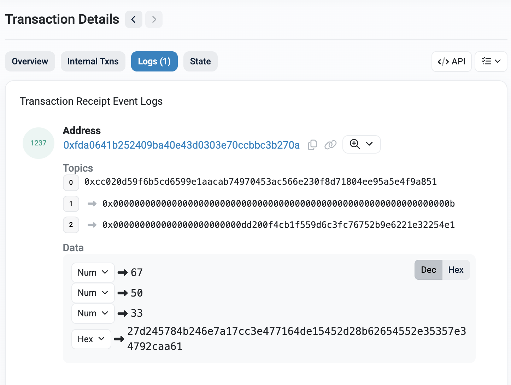

# Production Tally Sample

**Environment:** Production assumptions  
**Network:** Ethereum Sepolia  
**Vote session:** voteId = 11

---

## Transaction

| Field | Value |
|-------|-------|
| Type | Tally finalization |
| Status | Success |
| Tx hash | `0x51c2dee59df2e5c4c452c961c1527ade97be27b98ae7e47d767bc52ad7f8c0b8` |
| Block | `9923721` |
| Explorer | [View on Etherscan](<https://sepolia.etherscan.io/tx/0x51c2dee59df2e5c4c452c961c1527ade97be27b98ae7e47d767bc52ad7f8c0b8>) |

---

## Contract

| Field | Value |
|-------|-------|
| TallyContract | `0xFda0641b252409bA40e43d0303e70CCbbC3b270A` |

---

## Final result

| Choice | Count |
|--------|-------|
| YES | 67 |
| NO | 50 |
| ABSTAIN | 33 |

---

## What this demonstrates

- Tally computed from encrypted votes only
- ZK proof verifies correct aggregation and decryption
- Result is immutably recorded on-chain
- No individual vote choices are revealed

---

## Verification steps

1. Open the transaction in the explorer
2. Confirm status is **Success**
3. Check for `TallyFinalized` event in logs
4. Verify recorded result matches the event parameters
5. Confirm tally was submitted after voting was closed

---

## Visual reference (Etherscan)

The image below shows the `TallyFinalized` event
as displayed in a standard Ethereum block explorer.

This image is provided as a **visual reference only**.
The authoritative source of verification remains
the transaction link and emitted event logs.

