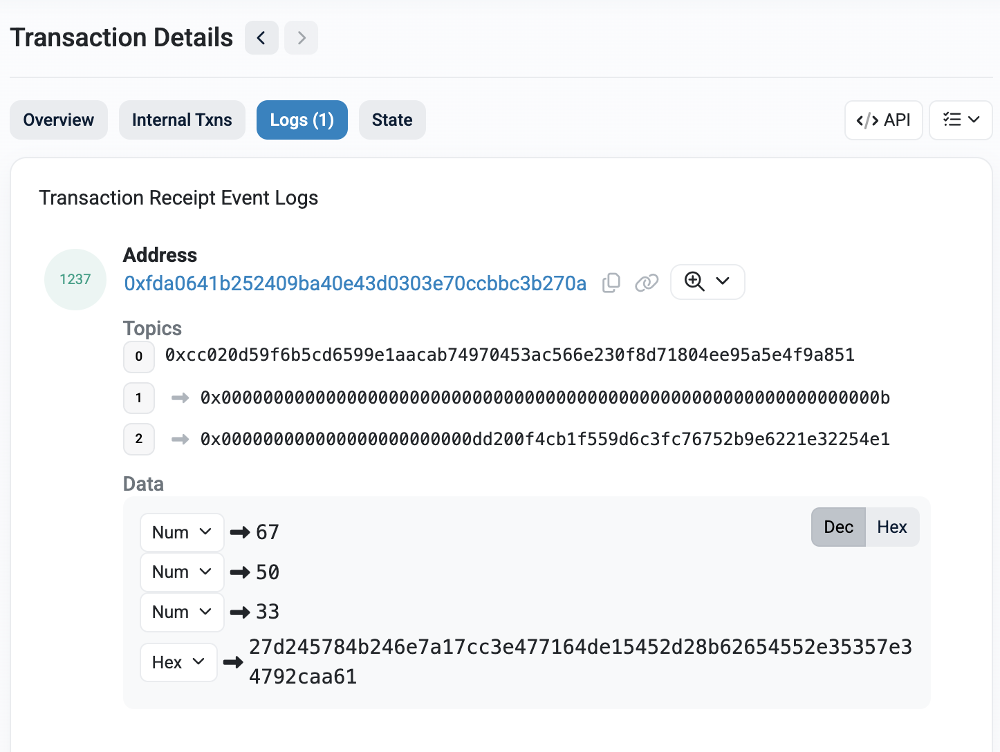

# Product-Configuration Tally Sample

**Environment:** Product configuration (snapshot-based weights)
**Network:** Ethereum Sepolia
**Vote session:** voteId = 11

---

## Transaction

| Field | Value |
|-------|-------|
| Type | Tally finalization |
| Status | Success |
| Tx hash | `0x51c2dee59df2e5c4c452c961c1527ade97be27b98ae7e47d767bc52ad7f8c0b8` |
| Block | `9923721` |
| Explorer | [View on Etherscan](https://sepolia.etherscan.io/tx/0x51c2dee59df2e5c4c452c961c1527ade97be27b98ae7e47d767bc52ad7f8c0b8) |

---

## Contract

| Field | Value |
|-------|-------|
| TallyContract | `0xFda0641b252409bA40e43d0303e70CCbbC3b270A` |

---

## Final result (on-chain)

| Choice | Weighted count |
|--------|----------------|
| YES | 67 |
| NO | 50 |
| ABSTAIN | 33 |

---

## What this transaction establishes

- The on-chain verifier accepted a Groth16 proof that this result is the correct homomorphic sum and decryption of **a batch** of 100 ciphertext sets committed by the proof's batch hash, under the registered coordinator public key
- Finalization happened only after voting was closed and dummy padding registered (contract-enforced ordering)
- The result is recorded immutably per voteId (one finalization only)

## What it does not establish

- That the committed batch equals the set of votes submitted on-chain — the contract does not reconstruct the batch hash from `VoteSubmitted` events; batch selection is trusted to the coordinator
- That only the aggregate was decrypted — unprovable under single-key ElGamal

See [`../../docs/verification.md`](../../docs/verification.md) and [`../../docs/threat-model.md`](../../docs/threat-model.md).

---

## Verification steps

1. Open the transaction in the explorer
2. Confirm status is **Success**
3. Check for the `TallyFinalized` event in logs
4. Confirm the recorded result matches the event parameters
5. Confirm the tally was submitted after voting was closed

---

## Visual reference (Etherscan)

The image below shows the `TallyFinalized` event as displayed in a standard block explorer. The authoritative source remains the transaction and its emitted logs.

